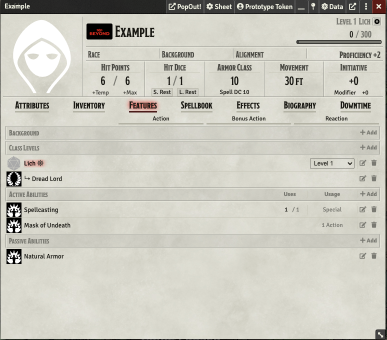
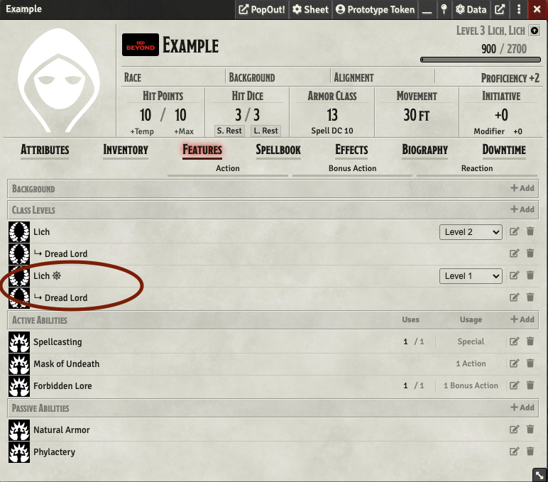
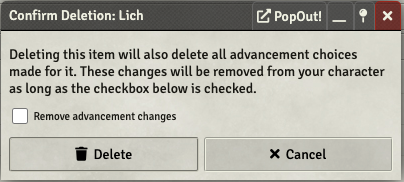

# The Lich Class Usage

This document will describe how to more user friendly way to implement the Lich race and class by Mister_Thr33. This is about as close as I can get it to perform accurately.

## Prereqs/My Build
* Foundry v9.249
* DnD5e - Fifth Edition System v1.6.3
* plutonium v1.58.0
* Koboldworks - Data Inspector v3.1.0 (if you want to look at resource counters)
* Link Item and Resource DnD5e v1.2.2

## Getting Started
First you should simply create an actor with your choice of race. You can also omit adding a race until everything else is done, I'm not your boss.

Next use plutonium to directly import the Lich class from the character sheet. This should prompt you to choose certain options regarding character creation and spell selection. Please choose a subclass at this point as well.
Afterward the Features tab on your character sheet might look something like this:

From we have to make a couple of changes if we want to play a level 1 lich. First is to choose your spells. Remember that you get four for your spellbook and two from the Spells Known column. The second is to simulate the Natural Armor feature by clicking the wheel in the Armor Class section and changing the Calculation to "Mage Armor." Update the value and you should be set!

## Level Up Quirks
This is not a perfect homebrew conversion. One of the biggest flaws here is how level up works. I'm not clear on which workflow is being used in certain instances but there is a way to consistently level up without losing your character data.
If you have already chosen your subclass in character creation, click on the level up button at the top right of the character sheet. This will bring you to some more prompts. It will again give you a list of cantrips to choose from. ***Please do not choose any more cantrips unless your lich level allows it.*** I'm not sure yet on how to avoid this prompt from coming up again. 
Your character sheet features should look something like this:

Notice that there are two sources of Lich levels. Please delete the lower two features circled in the photo. When you do, ***please uncheck the "Remove advancement changes" box*** so that you don't lose any other features. 

One of these stray Class Levels or Subclass Features may have moved into the "Passive Abilities" list. Remove this as well. Unfortunately you must do this every time you level up.
